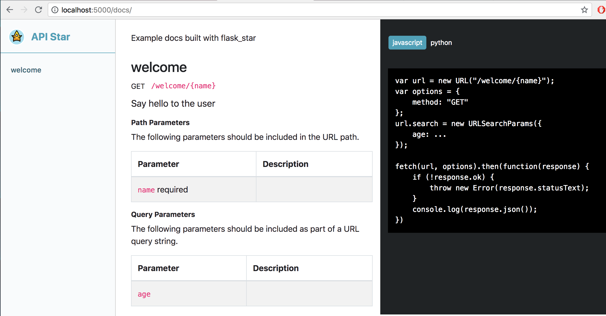

# flask_star
Porting apistar features to flask

### Project Scope:
 - API Documentation from flask endpiont function signatures
    - Native Types (functional)
    - URL Parameters (functional)
    - Query parameters (functional)
    - Endpoint groups by flask blueprint (functional)
    - APIStar typesystem support (not functional)
 - Dependency injection
    - Builtin components (not functional)
    - User defined component framework (not functional)

#### API Documentation
Goals for api documentation are to dynamically produce accurate documentation automatically from function signatures and type declarations. A minimal working example is below
```python
from flask import Flask
from flask_star import Documentation

app = Flask(__name__)

@app.route('/welcome/{name}')
def welcome(name: str, title: str = ''):
    return f'Welcome {title} {name}'

if __name__ == '__main__':
    api_docs = Documentation(app,
                             title='flask_star',
                             description='Basic flask_star example',
                             version='0.0.1',
                             static_dir='static/',
                             docs_route='/docs/')
    print(api_docs)
    app.run(debug=True, port=5000)
```
Generates browser viewable documentation

And a corresponding openapi specification at `/<docs_route>/openapi.json`
```json
{                                                                 
    "openapi": "3.0.0",                                           
    "info": {                                                     
        "title": "flask_star",                                    
        "description": "Basic flask_star example",                
        "version": ""                                             
    },                                                            
    "paths": {                                                    
        "/welcome/{name}": {                                      
            "get": {                                              
                "operationId": "welcome",                         
                "parameters": [                                   
                    {                                             
                        "name": "name",                           
                        "in": "path",                             
                        "required": true,                         
                        "schema": {                               
                            "type": "string"                      
                        }                                         
                    },                                            
                    {                                             
                        "name": "title",                          
                        "in": "query",                            
                        "schema": {                               
                            "type": "string"                      
                        }                                         
                    }                                             
                ]                                                 
            }                                                     
        }                                                         
    }                                                             
}
```
